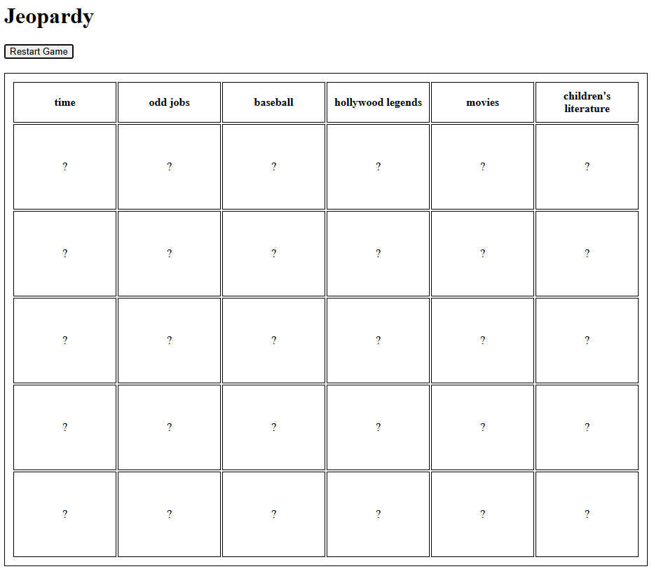

# SB-Exercise-Assessment-10.4-Jeopardy

Springboard SE Bootcamp - Jeopardy Assessment for Section 10.4

Right click on the index.html and click "Open with Live Server". This requires the Live Server extension in VSCode -
VS Marketplace Link: https://marketplace.visualstudio.com/items?itemName=ritwickdey.LiveServer

Upon opening it with Live Server, you will see a heading with "Jeopardy" and a loading-gif. Once the categorical data loads, it will show a game like the picture below.

You can click on the table data cells so it goes ? -> question -> answer.

Minimal styling was added so table cells have a fixed layout and some height/width.

In my implementation, I have an initial load to only setup the loading-gif and restart game button once. Other than that, when you click "restart game", it will delete the jeopardy table and reload new category data. In the setup, it calls fillTable() which will dynamically create the jeopardyTable, and load in the data accordingly and add click handler.
